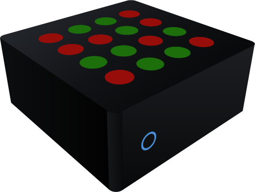

# `tpi-bro` &nbsp; – &nbsp; a Turing Pi 2 Cluster Bootstrap project

> This is a practical, minimal bootstrap to get a [Turing Pi 2](https://turingpi.com/) cluster with 4 [RK1](https://docs.turingpi.com/docs/turing-rk1-specs-and-io-ports) compute modules to a working state fast.
>
> * **[docs/GETTING-STARTED.md](docs/GETTING-STARTED.md)** &nbsp; – &nbsp; the full installation walkthrough: hardware assembly, prerequisites, flashing, and network setup. Start there.
> * [Initial bootstrap](#initial-board-and-cluster-bootstrap-expect-flashing-and-network-setup) below covers the same ground (Phase A) at a reference level, for extending the scripts rather than following along step-by-step.
> * [A GitOps workflow](#handoff-from-bootstrap-expect-to-cluster-orchestration-k8sgitops) handles the rest, K8s orchestration, etc.<br>(These are Phases B through D, all the way up to a "Hello, World!" example for a multi-agent setup.)
>
> **Disclaimer**: This project has yet to play with Nvidia Jetson (Orin) Nano and CM4 adapters for RPi, so it's not possible to tell if these scripts and instructions will help anyone to get started for such configurations.

## Is this for you?

Before you buy hardware: a TuringPi 2 + RK1 cluster is a genuinely fun,
low-power platform for learning real Kubernetes/GitOps operations and
experimenting with on-device NPU inference — it is **not**, today, a
GPU-class LLM inference box or a real-time transcription appliance. The
RK3588 NPU's advertised 6 TOPS/module doesn't translate to 6 TOPS of usable
transformer throughput (measured FP16 matmul ceiling is ~230 GFLOP/s; INT8
would be much faster but is currently broken for transformer models on this
stack).

**→ [docs/IS-THIS-FOR-YOU.md](docs/IS-THIS-FOR-YOU.md)** is the pragmatic,
experience-based rundown — measured performance, what actually works today
(batch Whisper STT, small local LLMs, general cluster ops), what doesn't yet
(real-time NPU transcription, anything GPU-shaped), and the real roadblocks
hit building this.

## What the cluster is *for*: a queue-fronted execution tier

Beyond the bring-up itself, tpi-bro is heading somewhere specific: a cluster
you hand work to through a **typed job queue**, and that handles everything
behind it — scale-from-zero per job type, capability-based placement (NPU,
NVMe), warm-model affinity, and priority-based eviction of work that no
longer matters. Push a job; the right container runs on the right node; the
cluster scales back to zero when the work is done.

The queue is the *entire* integration surface — no producer ever touches
Kubernetes, and the cluster never knows what sits upstream. That makes it
equally usable as the execution tier of a focus-following personal
automation system (the design driver: supporting work switches when your
attention does, with close-to-live audio transcription as one trigger
pathway), or simply as a small, low-power processing machine for whatever
your own scripts want to enqueue. The architecture and rationale live in
[ADR-0028](docs/adr/ADR-0028-job-queue-as-sole-external-boundary.md) and
[ADR-0022](docs/adr/ADR-0022-event-driven-scheduling-and-interruptible-workloads.md);
the contract itself is
[ADR-0029](docs/adr/ADR-0029-job-queue-contract-v1.md), and the build-out
is tracked as E-01–E-06 in [the backlog](docs/backlog/BACKLOG.md).

**See it happen:** [docs/FOCUS-DEMO.md](docs/FOCUS-DEMO.md) runs two
competing tasks — tiered near-realtime speech transcription vs. a chunked
compute job — through the queue, switches "focus" between them live (fixed
priority bands rotating, evicted chunks re-queuing themselves), and puts
the whole thing on a Grafana dashboard: `./scripts/run-focus-demo.sh
scenario`.

## Getting started

**→ [docs/GETTING-STARTED.md](docs/GETTING-STARTED.md) is the full installation walkthrough** — hardware assembly, prerequisites, Phase A (flash/name/network), Phase B (k3s/registry/storage), Tailscale, and populating the registry with application images. Start there.

Quick taste, if you already know what you're doing and just need the commands:

```bash
git clone https://github.com/your-org/tpi-bro && cd tpi-bro
chmod +x scripts/*.sh scripts/*.exp
cp bootstrap-config.kv.example bootstrap-config.kv && $EDITOR bootstrap-config.kv

./scripts/bootstrap-turingpi-cluster.exp --dry-run --phase A   # preview
./scripts/bootstrap-turingpi-cluster.exp --phase A             # Phase A: flash, name, network (~1h)
./scripts/bootstrap-operational.sh                             # everything else, one command:
                                                               #   k3s, registry, storage, resource
                                                               #   policy, capability labels, Tailscale
                                                               #   mesh, GitOps, Ollama, monitoring —
                                                               #   ends with the health check green
```

`bootstrap-operational.sh` is staged and resumable (`--from`/`--to`/`--dry-run`);
a failed stage prints the exact resume command, and re-running the whole chain
against a built cluster is safe — every stage is idempotent. Prefer smaller
steps? `./scripts/bootstrap-phase-b.sh` still runs just the Phase B core, and
each stage's underlying script can be run on its own.

Phase B (k3s + persistent registry + NVMe + Ollama) and Phase D (example agents + monitoring) are complete. See [docs/ROADMAP.md](docs/ROADMAP.md) for current state.

---

## Introduction

### Project History

This project started from a need to have a reproducible way of bootstrapping a TuringPi cluster, given that many laptops today do not have Ethernet ports but rely on WiFi for connectivity.

### Project Goals

Among the things that were on the "wanted features" list were

* **Automate** cluster and compute module **discovery**,
* **Flash** the RK1 **compute modules** with the standard ubuntu images,
* Name the nodes (i.e., compute modules) so that they have **distinct hostnames**,
* establish a **docker registry** for storing application images, and
* **orchestrate** all **applications** through Kubernetes (i.e., k3s actually) to be able to scale up / down applications depending on the user's current focus / need.

Check out the [open backlog](docs/backlog/BACKLOG.md) for open work items and future additions to the project. Maybe you want to help out in realizing these?

### Project Name

**`bro`** for "bro(ther)" to help you out or "bro" (Swedish for "bridge") to bridge the gap you're facing when starting out.

---

## Initial board and cluster bootstrap: Expect (flashing and network setup)

This repo contains a resumable, staged [**Expect**](https://core.tcl-lang.org/expect/index) bootstrap for a [Turing Pi](https://turingpi.com/) ([BMC](https://docs.turingpi.com/docs/turing-pi2-bmc-intro-specs)) + 4× [RK1](https://docs.turingpi.com/docs/turing-rk1-specs-and-io-ports) nodes to reach a wanted board bring up "baseline". The "baselines" are categorized into "Phases" with varying degrees of Docker/Kubernetes capabilities up to a working "Hello, World" multi-agent setup example. E.g., "Phase A" contains
- Nodes named `rk1-node{1..4}` with a unified password
- Laptop `/etc/hosts` updated
- An **ephemeral** (HTTP) Docker registry running on `rk1-node1` with `--restart=always`

The Expect script is designed to be:
- **Resumable**: run a slice with `--from` / `--to`
- **Dry-run capable**: see what would happen with `--dry-run`
- **Mode-aware**: choose flashing mode `--flash skip|local|image|download|bmc` (see [docs/GETTING-STARTED.md](docs/GETTING-STARTED.md#flashing-modes-step-3-in-detail))
- **Stateful**: discoveries are saved to `bootstrap-state.kv`
- **Rediscoverable**: `--rediscover` re-scans the subnet after DHCP reassignment, with no power cycling

For hardware assembly, prerequisites, and step-by-step usage, see
[docs/GETTING-STARTED.md](docs/GETTING-STARTED.md). The reference below covers
what's in the repo and the stage-by-stage mechanics for anyone extending it.

---

### Files

| Path | Purpose |
|------|---------|
| `scripts/bootstrap-turingpi-cluster.exp` | Main bootstrap Expect script (staged, resumable, `--rediscover` mode) |
| `scripts/teardown-cluster.exp` | Reverses Phase A — resets nodes to a re-bootstrappable state |
| `scripts/bootstrap-host-helper.sh` | Manages `/etc/hosts` entries (`hosts-append` / `hosts-remove`) |
| `scripts/setup-static-ips.sh` | Phase B0: configure static IPs on BMC and all nodes |
| `scripts/setup-ssh-keys.sh` | Phase B0: distribute SSH key + passwordless sudo to all nodes |
| `scripts/install-k3s.sh` | Phase B1: install k3s server and agents |
| `scripts/gen-registry-certs.sh` | Phase B2: generate TLS certificates for the registry |
| `scripts/install-ca.sh` | Phase B2: install CA cert + containerd mirror config on a node |
| `scripts/setup-registry.sh` | Phase B2: full orchestration — certs → chart deploy → CA distribute |
| `scripts/bootstrap-phase-b.sh` | Phase B orchestrator — runs B0→B2 in order; `--from`/`--to` resume; `--dry-run`; `--check` |
| `charts/registry/` | Helm chart for the persistent Phase B registry |
| `bin/kubectl` | Vendored `kubectl` binary pinned to the cluster version |
| `bootstrap-state.kv` | Generated state file — discovered IPs, MACs, BMC address (gitignored) |
| `bootstrap-config.kv` | Local config overrides — subnet, node count, flash mode, etc. (gitignored) |
| `bootstrap-config.kv.example` | Template documenting all config variables |
| `images-manifest.kv.example` | Template for `--flash download` image manifest |
| `bmc-manifest.kv.example` | Template for A0 BMC firmware check/upgrade |
| `tests/run-ci.sh` | CI test runner — Suites 1+2 (Phase A dry-run + mock), no hardware required |
| `tests/run-hardware.sh` | Hardware test runner — Suite 3, full Phase A cluster cycles |
| `tests/check-cluster.sh` | Suite 4: 10-check cluster health test (Phase B); `--quick` skips pod-pull checks |
| `docs/` | PREREQUISITES, TROUBLESHOOTING, and status documents |
| `docs/adr/` | Architecture Decision Records |

Make the scripts executable:

```bash
chmod +x scripts/*.sh scripts/*.exp
```

Full usage, flashing modes, BMC firmware handling, troubleshooting, and
configuration variables are all covered in
[docs/GETTING-STARTED.md](docs/GETTING-STARTED.md). Show all CLI flags with
`./scripts/bootstrap-turingpi-cluster.exp --help`.

---

### Expect Script Stages ("Phase A")

| Stage | Name | What it does |
|-------|------|--------------|
| A0 | `bmc_firmware` | Optional BMC firmware check or upgrade (default: skip); see [BMC firmware](docs/GETTING-STARTED.md#bmc-firmware-a0) |
| A1 | `find_bmc` | Discover BMC via `nmap` or manual entry; pin `turingpi.local` in `/etc/hosts`; extract BMC MAC |
| A2 | `poweroff_all` | Power OFF all RK1 nodes via `tpi power off` |
| A3 | `flash_optional` | Optional flash — `skip` / `local` / `image` / `download`; see [flashing modes](docs/GETTING-STARTED.md#flashing-modes-step-3-in-detail) |
| A4 | `power_on_and_discover` | Power nodes on one-by-one; discover IPs via delta scan; extract MACs; print DHCP reservation summary |
| A5 | `name_password_reboot` | Change password, set hostnames (`rk1-node{1..4}`), reboot |
| A6 | `write_hosts_on_laptop` | Append node IP↔hostname entries to laptop `/etc/hosts` |
| A7 | `ephemeral_registry_phaseA` | Install Docker on node1; start `registry:2` (HTTP, `--restart=always`) |

Each stage is written with check→act logic where practical, so reruns are safe.

DHCP/IP stability, full configuration variable reference, troubleshooting, flashing
modes, and BMC firmware handling are all covered in
[docs/GETTING-STARTED.md](docs/GETTING-STARTED.md).

### Testing

```bash
./tests/run-ci.sh            # Suite 1 (dry-run) + Suite 2 (mock), no hardware
./tests/run-hardware.sh --cycles 2          # bootstrap→teardown cycles on real hardware
./tests/check-cluster.sh                    # Phase B 10-check cluster health test
```

The CI suite (dry-run + mock, no hardware) runs automatically on every push/PR.
See [docs/TEST_STATUS.md](docs/TEST_STATUS.md) for the full coverage map —
including what's genuinely live-tested vs. dry-run/mock-only.

---

## Teardown

`teardown-cluster.exp` reverses Phase A cleanly — useful for scratch-reinstall testing or decommissioning. It resets every node to a re-bootstrappable state (default credentials, no registry, hostnames reset) and powers them all off.

### Why a separate teardown script?

The bootstrap is intentionally forward-only (idempotent stages, check→act). Teardown runs in the opposite direction with different concerns — it must locate nodes even when IPs have drifted, and it must succeed even if parts of Phase A were never completed.

### Teardown stages

| Stage | Name | What it does |
|-------|------|--------------|
| T1 | `load_state` | Load state; verify each node IP is live; scan subnet by hostname if IPs drifted |
| T2 | `verify_connectivity` | Report resolved IP for each node |
| T3 | `stop_registry` | Stop and remove the `registry:2` container on node1 |
| T4 | `reset_passwords` | Reset all node passwords to `ubuntu:ubuntu` |
| T5 | `reset_hostnames` | Reset hostnames to `ubuntu`; remove `127.0.1.1 rk1-nodeN` from node `/etc/hosts` |
| T6 | `clean_laptop_hosts` | Remove `rk1-node{1..4}` and `turingpi.local` from laptop `/etc/hosts` |
| T7 | `poweroff_nodes` | Graceful `sudo poweroff` per node; waits for SSH to drop; BMC `tpi power off` |
| T8 | `clear_state` | Archive `bootstrap-state.kv` with a timestamp |

T1 is resilient to IP drift — it tries stored IPs first, then falls back to scanning the subnet and identifying nodes by their SSH hostname. You do not need a valid state file to run teardown.

Usage, flags, and the full reinstall cycle are covered in
[docs/GETTING-STARTED.md](docs/GETTING-STARTED.md#starting-over).

---

## Handoff: From Bootstrap (Expect) to Cluster Orchestration (K8s/GitOps)

This project intentionally splits responsibilities between bootstrap automation (imperative, with Expect) and cluster orchestration (declarative, with Kubernetes + GitOps).

### Where Expect ends (Phase A)

The Expect script (`bootstrap-turingpi-cluster.exp`) is only responsible for one-time or out-of-band setup that cannot be declaratively managed inside Kubernetes:

- Optionally check or upgrade BMC firmware (A0)
- Discover the BMC and RK1 nodes on the LAN
- Power cycle nodes to ensure a clean baseline
- Optionally flash OS images (local, from disk, or downloaded with SHA256 verification)
- SSH into nodes with default credentials and update passwords
- Assign stable hostnames (`rk1-nodeX`) and reboot
- Update `/etc/hosts` on the laptop with node mappings
- Bring up a basic, ephemeral Docker registry on `rk1-node1`

Once the registry is reachable and each node has a hostname and working SSH, the cluster is considered bootstrapped. At this point, Expect stops — its job is done.

### Where Kubernetes / GitOps begins (Phase B and onwards)

Everything after bootstrap is handled declaratively via Kubernetes manifests and GitOps tooling:

**Phase B:** Persistent registry with TLS + basic auth, k3s, NVMe storage, Tailscale mesh, monitoring. **Complete** as of 2026-05-11. See [docs/ROADMAP.md](docs/ROADMAP.md).

**Phase C:** Local registry mirror + sync from laptop, IP resilience (static DHCP or CoreDNS), cloud expansion notes. Not started.

**Phase D:** Multi-agent workloads, Ollama per node, observability. **D-01 (Ollama) + D-04 (Prometheus + Grafana) complete.** (Agent workloads are consumer-owned — this repo doesn't ship or deploy any itself.) RKNN NPU inference validated on node1 — Whisper `medium` STT container images built and benchmarked, 2026-06-16; end-to-end chart validated on hardware (both CPU and RKNN paths), 2026-08-14. GitOps (B-04) complete. W-03 (KV-cache decoder) done 2026-08-14; the job-queue boundary (E-01, ADR-0028/0029) and the focus-switching demo landed 2026-08-15.

Recommended workflow:
1. Build & push images from CI/CD into the cluster-local registry
2. Describe desired workloads (Deployments, Services, Ingress) using Helm or Kustomize
3. Commit to Git (platform repo)
4. Argo CD / Flux continuously reconciles cluster state to match the repo
5. Promotions between environments = pull requests, not manual commands

### Why this split?

Expect excels at scripting fragile, one-time, interactive steps (BMC control, initial password, USB flashing).

Kubernetes/GitOps excels at continuously reconciling declarative state inside the cluster.

Trying to use Expect inside the cluster would create snowflake states and drift. Conversely, trying to use Helm/Argo to flash USB images or reset BMC power would be impossible.

By drawing the line here, the system is reproducible from bare metal up through workloads:
- **Rerun Expect** = fresh cluster baseline
- **Sync GitOps** = workloads deployed

---

## Architecture Notes

### Hardware

| Component | Spec |
|-----------|------|
| Board | TuringPi 2 |
| Compute modules | 4× RK1 (Rockchip RK3588, ARM64) |
| RAM per module | 32 GB LPDDR5 |
| Total cluster RAM | 128 GB |
| GPU | Mali G610 MP4 (OpenCL; not suitable for LLM inference) |
| NPU | 6 TOPS per module (24 TOPS total); RKNN inference validated (Whisper medium, 2026-06-16) |
| Idle power | ~10 W per module |

Advertised NPU TOPS is an INT8 conv figure; real transformer (matmul-heavy,
FP16-only until INT8 is fixed) throughput is much lower. See
[docs/IS-THIS-FOR-YOU.md](docs/IS-THIS-FOR-YOU.md) for the measured numbers
and [docs/HARDWARE-FIRMWARE-ISSUES.md](docs/HARDWARE-FIRMWARE-ISSUES.md) for
the specific hardware/firmware issues behind that gap.

### LLM Placement Constraint

**LLMs require contiguous memory.** A model's weights must reside entirely within one physical machine's address space — you cannot shard a single model across RK1 modules. This means:

- Each LLM-backed agent service maps to exactly one RK1 module
- Maximum model size: ~28–30 GB (32 GB minus OS overhead)
- The number of simultaneously-running LLM agents ≤ number of nodes

Supporting services (API gateway, vector DB, queue, metrics) are stateless or distributed and can be scheduled freely across nodes.

**Suggested initial workload distribution:**

| Node | Hostname | Role |
|------|----------|------|
| 1 | `rk1-node1` | k3s control plane + example agent |
| 2 | `rk1-node2` | Future LLM agent |
| 3 | `rk1-node3` | Future LLM agent |
| 4 | `rk1-node4` | RAG / vector DB / supporting infra |

### Tool Roles

| Tool | Role in this project |
|------|---------------------|
| Expect | Phase A only: drive interactive SSH, handle boot timing, discover IPs |
| k3s | Lightweight Kubernetes (single binary, SQLite, ARM64 native) |
| Helm | Deploy Phase B registry and future workloads |
| Argo CD / Flux | GitOps controller — reconcile cluster to Git state continuously |
| Ollama | LLM inference runtime on each agent node |
| Traefik | Ingress (bundled with k3s) |
| Prometheus + Grafana | Observability — Grafana exposed on Tailnet |

---

## Project Status

See [docs/ROADMAP.md](docs/ROADMAP.md) for phase-by-phase status and [docs/OPERATIONS.md](docs/OPERATIONS.md) for hardware/software inventory.

Open work items are tracked in [docs/backlog/BACKLOG.md](docs/backlog/BACKLOG.md).

Architectural decisions are recorded in [docs/adr/](docs/adr/).

## License

MIT — see [LICENSE](LICENSE). Provided "as is," no warranty — see the license text for the full disclaimer.
